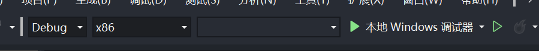
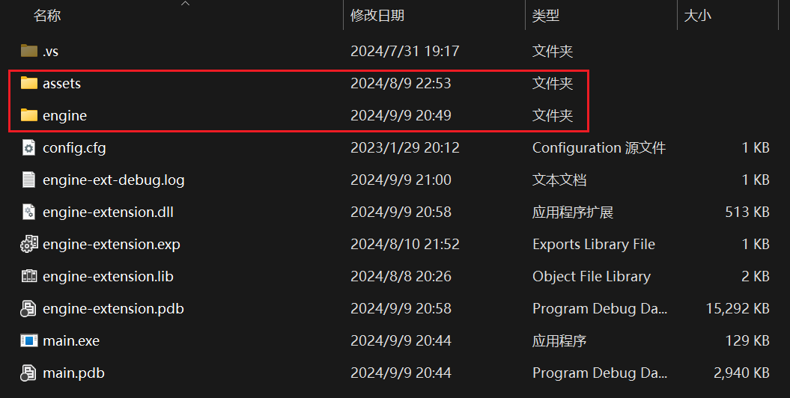

# SMBX 38A 运行时功能增补程序

该工程有两个目的：

1. 规范化 38a 版的 SMBX 游戏体验流程，断掉原引擎本身的编辑器功能；
2. 增强 38a 版 SMBX 游戏的体验（强制全屏并修正全屏表现，扩展图形渲染能力（比如提供屏幕后处理）等功能）

## 环境配置

由于 SMBX 38a 只运行在 windows 环境中，该项目不需要考虑为其它运行环境生成可执行程序。为了方便管理，该项目使用 VS 2019 作为构建管理工具。在拉取了项目（包括 detours 子模块，特殊地，detours 使用 VS 2019 构建）后，直接打开 smbx-enginex.sln 即可。

### 编译设置

由于 C++ 标准和平台工具集版本选择上的失策，目前该项目只能在 windows10 及以上的 x86 windows 台式机上编译成功……由于 SMBX 源程序为 32 位，我们的项目也需要将编译目标设置为 32 位。

在 smbx-enginex.sln 打开无误后，逐个编译各个子工程即可：




### 运行生成结果

该项目的生成结构需要依附于 SMBX 源程序运行。在编译完成后请将 smbx-enginex.sln 同级目录下的 assets.zip 与 engine.zip 解压缩到编译目标下的同名文件夹：


**main.exe** 为项目的入口程序，其会尝试将 ./assets/main 中的入口关卡提供给 ./engine/engine-ext.exe。。

## 项目结构

该项目由四个子工程组成：

- Detours 为微软提供的 Hook 工具
- engine-extension 为增补程序的主体
- main 为入口程序
- redirection 用于关联 ./engine/engine.exe 和 ./engine-extension.dll

### Main

子工程 main 只做两件事：

1. 拉起 ./engine/engine.exe（SMBX 源程序），并将入口场景作为参数传递给 SMBX。
   ```cpp
   /* ... */
       if (CreateProcess(
           NULL,
           x,
           NULL,
           NULL,
           false,
           dwFlags,
           (LPVOID)chNewEnv,
           TEXT("./engine"),
           &si,
           &pi
       )) return 0;
   /* ... */
   ```
   
   

2. 为拉起的程序设置 ENGINE_PASSPORT 环境变量（该环境变量用于阻断直接打开 engine.exe 的行为，该阻断逻辑写在 redirection.dll 中）。
   ```cpp
   /* ... */
   	auto chNewEnv = new TCHAR[envSize]{ 0 };
       lpszCurrentVariable = (LPTSTR)chNewEnv;
       if (FAILED(StringCchCopy(lpszCurrentVariable, envSize, TEXT("ENGINE_PASSPORT=")))) return -3;
       lpszCurrentVariable += lstrlen(lpszCurrentVariable);
   /* ... */
   ```


### Redirection

子工程 redirection 用于链接 engine.exe 和 engine-extension.dll

该项目根目录中的 engine.zip 所提供的 engine.exe 是打了补丁的（可以用 CFF Explorer），它被后期添加了一个对同目录下 redirection.dll 所导出的名为 "_" 的函数依赖，这使得 engine.exe 打开时会寻找 redirection.dll 并运行其入口函数（dllMain）。

redirection.dll 也只干了两件事：

1. 检查当前进程的环境变量 ENGINE_PASSPORT 是否满足要求，若不满足直接终止该进程。
   ```cpp
   /* ... */
           TCHAR buffer[256];
           DWORD size = GetEnvironmentVariable(TEXT("ENGINE_PASSPORT"), buffer, 256);
           if (size == 4) {
               auto res = lstrcmp(buffer, TEXT("NONE"));
               if (res) ExitProcess(-3);
           }
   
           else if (size > 0 && size < sizeof(buffer)) {
               auto res = lstrcmp(buffer, PASSPORT);
               if (res) ExitProcess(-1);
           }
           else ExitProcess(-2);
   /* ... */
   ```

2. 拉起 engine-extension.dll 并运行其导出的 engineStart() 函数。

### Engine-extension

该子工程为增补程序的主体工程。它由 redirection.dll 拉起，并对 SMBX 源程序（./engien/engine.exe）中相应的函数进行 hook 处理。其主体逻辑参见 main.cpp（虽然 engine-extension 的初始化逻辑应该从 dllMain.cpp 开始，不过对于具体的业务还是倾向于剥离初始结构）。

#### 线程布设

为了不影响 SMBX 主程序的正常运行，Engine-extension 为增补程序单开了一条线程（下称增补线程）。增补线程和 SMBX 主线程的偏差不会超过大于一帧`（若某个线程即将超过则会被阻塞，这是由于 D3D9 (smbx 所使用) 和 D3D11 (增补程序所使用) 都是线程不安全的，Engine-extension 为了获得 D3D9 的渲染结果必须要在该处进行线程同步）`。

理论上说，所有的增补程序逻辑都应该在增补线程中运行。为了安全上考虑，应该尽量减少线程间的往来。

#### 生命周期

增补程序的生命周期完整地罗列在 main.cpp 中：

```cpp
// 外挂引擎启动 (运行在主线程)
void MainStart() { /*... 此处是 hook 逻辑和增补模块的初始化工作 */ }

// smbx 的主循环, 由 D3d9 的 Present 函数带动 (运行在主线程)
// 所以 D3d9 设备实例创建前这个函数不会运行(所以就刚打开程序而言会延迟一些)
void SmbxUpdate() { /*...*/ }

// 外挂引擎主循环(和 smbx 主循环不在一个线程, 涉及到数据交互时注意竞争问题) (运行在增补线程)
void MainUpdate(float t) { /*... 增补模块的帧轮询*/ }

// 外挂引擎销毁前执行 (运行在主线程)
void MainEnd() { /* ... 还原 hook 和增补模块的销毁*/ }
```

#### 业务模块

目前增补程序的主体一共分为几个大类（按文件夹分）：hook、render、util，所有的业务模块根据功能不同分别置于其中。

##### hook

hook 主要管理对 smbx 源程序中函数的 hook 工作。目前只 hook 了 d3d9 的所有接口、winapi 的 GetMessage(...)、winapi 的 MessageBoxW(...)、winapi 的 ShowWindow(...)。

其中：

- d3d9 用来拦截渲染信息。
- ShowWindow 用来获取 smbx 的主窗口
- MessageBoxW 用来拦截 smbx 的提示弹窗（smbx 是支持在 teascript 中调用函数弹出 msgBox 的，并且 msgBox 会阻塞 smbx 主线程的运行。我们可以获得 msgBox 的信息实现在 teascript 中调用增补程序的逻辑）。

##### render

render 文件夹下主要是渲染模块，其主体可见 render.cpp。在 render.cpp 中也明确地列出了渲染模块的生命周期。目前它主要是拿到 d3d9 的渲染结果并拷贝到 d3d11 的贴图上。再通过增补程序的渲染管线绘制到屏幕上。

关于 d3d9 和 d3d11 的信息交互可以看 renderResource.cpp 中的 SendSmbxBuffer_Internal 函数。在 render.cpp 中的 ExEngine::Render::Update 函数中，每帧一开始，SendSmbxBuffer_Internal 会先执行，将 smbx 的渲染结果拿到增补程序中。目前是直接渲染出来，后续可以加些后处理的选项，再通过 msgBox 实现 teascript 中触发后处理……

renderResource.cpp 和 renderDevice.cpp 的其它部分则主要是做一些管线设备和资源的初始化工作。

##### util

该文件夹下主要是存放一些工具模块。

1. logger 用于规范化输出 log。log 会输出到 main.exe 同级目录下的 engine-ext.log 中。如果是 debug 模式，则不过滤 log，否则只会输出 RuntimeLog 和 Assert 信息。
2. staticEventMgr 事件分发器。具体的事件声明在 event.h 中
3. timeMgr 时间管理器。提供获取当前帧时间的接口，也提供延迟某个函数到 xx 秒后执行的接口。
4. uuidGen UUID 生成器
5. strUtil 和 winapUtil 提供了一些工具函数（宽字串转 std::string、获取当前窗口名等……）

#### 其它

- smbxContext.cpp 该文件用于整理 smbx 主程序的资源（比如获取到的 smbx 窗口）
- window.cpp 该文件用于创建增补程序的窗口。smbx 本身的窗口会被增补程序覆盖。我们拿到 smbx 的渲染结果渲染到增补程序提供的窗口上已解决一些 smbx 本身的图形渲染和窗口所存在的问题。

## 理论上的正确运行效果：


👆全屏，且无错误缩放（为了让 4 : 3 的画幅适应绝大多数宽屏，程序里留了黑边）
